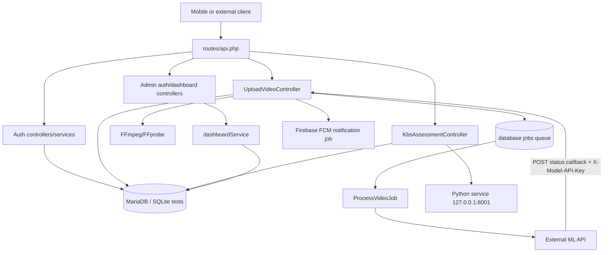

# MentalState Project Documentation

> Code-grounded onboarding guide for the Laravel API in this repository. Reviewed 2026-09-09.

## 1. Overview

MentalState is a Laravel 12 backend for a mental-health assessment product. Its intended users are people who submit a video, receive machine-learning analysis, and complete a questionnaire-like KBS assessment. The application stores the user account, uploaded media, model scores, answers, and assessment reports.

The core workflow combines video/audio processing with an eight-branch assessment. A queued job sends the media to an external ML service; a callback records the model result. The KBS service then calls a separate local Python decision service as the user answers questions. Administrators have a separate JWT guard and can request platform-level report data.

This repository is primarily an API/backend. It does not contain the product's mobile client or a completed web dashboard: the only web view is Laravel's default welcome page, while the JavaScript/CSS files are a minimal Vite/Tailwind shell. The README is still the stock Laravel README, so this document is the authoritative repository-specific onboarding reference.

## 2. Tech Stack

| Technology | Evidence | Role and likely reason |
|---|---|---|
| PHP `^8.2` | `composer.json` | Runtime required by the Laravel application. |
| Laravel `^12.0` | `composer.json` | Routing, HTTP controllers, validation, Eloquent ORM, queues, mail, config, migrations, and testing integration. |
| MariaDB/MySQL | `.env` currently selects `mariadb`; `config/database.php` | Development persistence for users, videos, assessments, jobs, cache, and sessions. |
| SQLite | `phpunit.xml` | Fast isolated test database. |
| Eloquent | `app/Models/*`, migrations | Model relationships and database access. |
| JWT Auth | `php-open-source-saver/jwt-auth`, `config/jwt.php` | Access and refresh tokens for user and admin API guards. |
| Sanctum | `laravel/sanctum`, `routes/api.php` | Only the default `/api/user` route uses `auth:sanctum`; the product routes use JWT guards. |
| Database queues | `QUEUE_CONNECTION=database`, `ProcessVideoJob` | Defers external video analysis from the request path. |
| FFmpeg/FFprobe | `pbmedia/laravel-ffmpeg`, `config/laravel-ffmpeg.php` | Extracts WAV audio and PNG thumbnails from uploaded video. |
| Firebase Admin/FCM | `kreait/laravel-firebase`, `SendAnalysisCompleteNotification` | Pushes analysis-complete notifications to stored device tokens. |
| Laravel Mail | `OtpMail`, `resources/views/emails/otp.blade.php` | Sends registration OTP email. |
| Vite 7, Tailwind CSS 4, Axios | `package.json`, `resources/*` | Asset bundling, utility CSS, and HTTP client bootstrap for the small included frontend shell. |
| Pest 3/PHPUnit | `require-dev`, `phpunit.xml`, `tests/*` | Automated test runner; current tests are smoke tests only. |

## 3. Architecture

The application uses Laravel's conventional HTTP -> controller -> service -> model design. Routes select middleware and controllers; controllers validate/request-map; services contain business operations; Eloquent models persist state; jobs handle asynchronous external work.



Observed service boundaries:

- The ML upload target is hard-coded in `app/Jobs/ProcessVideoJob.php` as `http://192.168.16.103:8000/process`.
- The KBS decision service is hard-coded in `app/Services/KbsAssessmentService.php` as `http://127.0.0.1:8001/api/branch{number}`.
- No Docker, deployment manifest, OpenAPI document, or external-service implementation is included.

## 4. Project Structure

```text
app/
  Console/Commands/             Custom Artisan commands, including make:service
  Http/Controllers/              API controllers, grouped by auth/admin where applicable
  Http/Requests/                 Form-request validation classes
  Http/Resources/                API resource transformers
  Jobs/                          Queued video-processing and notification jobs
  Mail/                          OTP mail class and email behavior
  Models/                        Eloquent models and relationships
  Providers/                     Laravel service provider(s)
  Services/                      Auth, upload, KBS, home, and dashboard business logic
bootstrap/                       Framework bootstrap and provider registration
config/                          Application, database, auth, JWT, mail, queue, Firebase, FFmpeg settings
database/
  factories/                     Test/data factories
  migrations/                    Schema history for users, admins, videos, assessments, jobs, etc.
  seeders/                       Database seeders
public/                          Front controller, robots.txt, and public storage link
resources/
  css/                           Tailwind/CSS entry point
  js/                            Vite JavaScript and Axios bootstrap
  views/                         Blade views, including OTP email and default welcome page
routes/
  api.php                        Product and admin API routes
  web.php                        Root web route
  console.php                    Console closure route (`inspire`)
storage/                         Runtime files, cache, logs, and public-upload backing store
tests/
  Feature/                       HTTP/application feature tests
  Unit/                          Unit tests
artisan                          Laravel CLI entry point
composer.json                    PHP dependencies and Composer scripts
package.json                     Frontend dependencies/scripts
phpunit.xml                      Test environment and PHPUnit configuration
vite.config.js                   Vite/Laravel asset configuration
README.md                        Stock Laravel README; does not describe MentalState
```

Key files include `routes/api.php`, `app/Services/Auth/AuthService.php`, `app/Services/UploadVideoService.php`, `app/Services/KbsAssessmentService.php`, `app/Services/dashboardService.php`, `app/Jobs/ProcessVideoJob.php`, and the migrations under `database/migrations`.

## 5. Setup and Installation

### Prerequisites

- PHP 8.2 or newer with the extensions required by Laravel and the installed packages.
- Composer.
- Node.js/npm.
- MariaDB/MySQL if using the checked-in development settings.
- FFmpeg and FFprobe available on `PATH`, or explicit binary paths.
- Access to an SMTP server for real OTP delivery.
- Access to the ML service and Python KBS service described in the architecture section.
- Firebase service-account credentials if push notifications are required.

### Clean clone

From the repository root:

```powershell
composer run setup
php artisan storage:link
```

`composer run setup` runs `composer install`, creates `.env` from `.env.example` if missing, generates `APP_KEY`, runs migrations, runs `npm install`, and builds Vite assets. Before migration, create the `mentalstate` database or change the database settings.

The checked-in `.env.example` defaults to SQLite-oriented Laravel conventions in some places, while the current local `.env` selects MariaDB. Choose one deliberately. For MariaDB, set at least:

```dotenv
APP_NAME=Invera
APP_ENV=local
APP_DEBUG=true
APP_URL=http://localhost
DB_CONNECTION=mariadb
DB_HOST=127.0.0.1
DB_PORT=3306
DB_DATABASE=mentalstate
DB_USERNAME=root
DB_PASSWORD=
QUEUE_CONNECTION=database
CACHE_STORE=database
FILESYSTEM_DISK=local
```

Also configure `JWT_SECRET`, mail settings, `ML_API_KEY`, `FIREBASE_CREDENTIALS`, and FFmpeg paths as needed. Never commit real credentials. The current checked-in `.env` contains secret-looking values and should be treated as compromised and rotated.

### Run locally

```powershell
composer run dev
```

This starts `php artisan serve`, `php artisan queue:listen --tries=1`, and `npm run dev` concurrently. The API normally listens at `http://localhost:8000`; Vite uses its own development port.

For a production-like asset build:

```powershell
npm run build
php artisan serve
php artisan queue:work
```

### Test

```powershell
composer run test
```

This clears config and runs `php artisan test`. `phpunit.xml` configures SQLite in-memory storage, array cache/mail/session, synchronous queues, and reduced bcrypt rounds. Current tests only check the default root response and `true`; they do not exercise product behavior.

## 6. Core Modules and Interfaces

### Authentication

`app/Services/Auth/AuthService.php` owns registration, OTP verification, login, JWT creation, refresh-token rotation, logout, password update, and FCM-token persistence. `AuthController` exposes the methods through `routes/api.php`. User routes use `auth:api` JWT middleware except the framework-default `/api/user`, which uses Sanctum.

`app/Services/Auth/AdminAuthService.php` handles admin login/logout, name changes, and password changes. Admin routes use the `auth:admin` JWT guard. Admin accounts are stored in `admins`, separate from `users`.

### Video upload and analysis

`UploadVideoController` delegates to `UploadVideoService`. The service stores the uploaded video on the public disk, extracts audio and a thumbnail through FFmpeg, creates a `Video` row, and dispatches `ProcessVideoJob`. The job posts multipart `video_file`, `audio_file`, and `video_id` to the ML service.

The callback endpoint `POST /api/video/{video}/status` accepts `status` (`analyzed`, `ready`, or `failed`) and, for `analyzed`/`ready`, `phq8_scores`. It checks `X-Model-API-Key` against `config('services.ml.api_key')`, updates the video, and may dispatch `SendAnalysisCompleteNotification`.

### KBS assessment

`KbsAssessmentService` starts/resumes an assessment, saves an answer, selects the next branch/question, calls the Python service, and stores final reports in the `kbs_assessments.reports` JSON column. Branches 1-8 map to `no_interest`, `depressed`, `sleep`, `tired`, `appetite`, `failure`, `concentrating`, and `moving`.

`KbsAssessmentController` exposes `POST /api/kbs/start`, `POST /api/kbs/next`, and `GET /api/kbs/video/{video}/reports`. A report lookup checks that the video belongs to the current user; the start path does not currently apply the same ownership check.

### Home and profile

`HomeConrtoller` (the filename/class spelling is inconsistent) exposes `/api/home` and `/api/user-info`, and handles `/api/upload-photo`. `HomeService` retrieves the latest video/user summary and stores avatars under `avatars`.

### Dashboard analytics

`dashboardService` aggregates completed assessments into platform report data, including branch counts, severity totals, and average percentages. `dashboardController::getPlatformAnalytics` exposes this at `GET /api/admin/dashboard/report` behind `auth:admin`.

### Notifications

`SendAnalysisCompleteNotification` loads all FCM tokens for the video owner and sends an “Analysis Complete” Firebase notification. It includes an `assessmentId` and frontend route in notification data. The referenced frontend route is not implemented in this repository.

## 7. Data Flow

### Registration and login

1. Client sends `POST /api/auth/register` with `user_name`, `email`, `password`, and `password_confirmation`.
2. Auth service creates or updates an unverified user, generates a six-digit OTP, caches its hash for ten minutes, and sends `OtpMail`.
3. Client sends `POST /api/auth/register/verify-otp` with email and OTP.
4. The service marks the email verified, returns user data, a JWT access token, and a stored refresh token.
5. `POST /api/auth/refresh` rotates a valid refresh token and returns a new JWT/refresh token pair.

### Video analysis and assessment

1. Authenticated client sends `POST /api/upload-video` with multipart `video` (MP4, AVI, or MOV; max 100 MB).
2. Upload service stores the media, synchronously extracts WAV/PNG derivatives, creates a `videos` record, and queues `ProcessVideoJob`.
3. The queue job posts files to the external ML API. The URL and outbound API key are hard-coded in the job.
4. ML service calls `POST /api/video/{video}/status` with `X-Model-API-Key`, status, and scores. The service persists scores and sends FCM notification when appropriate.
5. Client starts KBS with `POST /api/kbs/start` and submits each answer through `POST /api/kbs/next`.
6. For each branch, the Laravel service calls the Python endpoint, stores the answer/decision, and eventually stores reports in `kbs_assessments.reports`.
7. Client retrieves completed reports with `GET /api/kbs/video/{video}/reports`.

## 8. Configuration

### Application and runtime

| Variable | Default in config | Purpose |
|---|---|---|
| `APP_NAME` | `Laravel` | Application name and derived session/storage names. Current `.env` uses `Invera`. |
| `APP_ENV` | `production` | Environment label. |
| `APP_KEY` | none | Laravel encryption key; generated by `key:generate`. |
| `APP_DEBUG` | `false` | Debug output; local file currently enables it. |
| `APP_URL` | `http://localhost` | URL generation and public storage URLs. |
| `APP_LOCALE` / `APP_FALLBACK_LOCALE` | `en` | Locales. |
| `APP_FAKER_LOCALE` | `en_US` | Factory locale. |
| `APP_MAINTENANCE_DRIVER` | `file` | Maintenance mode backend. |
| `BCRYPT_ROUNDS` | `12` | Password hashing cost. |
| `LOG_CHANNEL` | `stack` | Logging channel and FFmpeg log channel. |
| `LOG_STACK` | `single` | Channels in the stack. |
| `LOG_LEVEL` | `debug` | Log threshold. |
| `LOG_DEPRECATIONS_CHANNEL` | `null` | Deprecation log channel. |

### Database, cache, sessions, queue, and storage

| Variable | Default | Purpose |
|---|---|---|
| `DB_CONNECTION` | `sqlite` | Active database driver; local `.env` uses `mariadb`. |
| `DB_URL`, `DB_HOST`, `DB_PORT`, `DB_DATABASE`, `DB_USERNAME`, `DB_PASSWORD`, `DB_SOCKET`, `DB_CHARSET`, `DB_COLLATION` | driver-specific | Database connection details. |
| `DB_FOREIGN_KEYS` | `true` | SQLite foreign-key enforcement. |
| `FILESYSTEM_DISK` | `local` | Default filesystem disk. |
| `QUEUE_CONNECTION` | `database` | Queue backend. |
| `DB_QUEUE_CONNECTION`, `DB_QUEUE_TABLE`, `DB_QUEUE`, `DB_QUEUE_RETRY_AFTER` | `jobs`/`default`/`90` as applicable | Database queue settings. |
| `CACHE_STORE` | `database` | Cache backend; OTP hashes use the cache. |
| `DB_CACHE_CONNECTION`, `DB_CACHE_TABLE`, `DB_CACHE_LOCK_CONNECTION`, `DB_CACHE_LOCK_TABLE` | framework defaults | Database cache settings. |
| `SESSION_DRIVER` | `database` | Session backend. |
| `SESSION_LIFETIME` | `120` | Session lifetime in minutes. |
| `SESSION_ENCRYPT` | `false` | Encrypt session data. |
| `SESSION_CONNECTION`, `SESSION_TABLE`, `SESSION_STORE` | framework defaults | Session storage settings. |
| `SESSION_DOMAIN`, `SESSION_SECURE_COOKIE`, `SESSION_HTTP_ONLY`, `SESSION_SAME_SITE`, `SESSION_PATH` | `/`, `true`, `lax`, or unset as configured | Cookie behavior. |
| `REDIS_URL`, `REDIS_CLIENT`, `REDIS_HOST`, `REDIS_USERNAME`, `REDIS_PASSWORD`, `REDIS_PORT`, `REDIS_DB` | `phpredis`, `127.0.0.1`, `6379`, `0` | Optional Redis settings. |
| `MEMCACHED_HOST` | `127.0.0.1` | Optional Memcached host. |

### Auth, mail, media, cloud, and integrations

| Variable | Default | Purpose |
|---|---|---|
| `JWT_SECRET` | none | Symmetric JWT signing secret; required for JWT operation. |
| `JWT_PUBLIC_KEY`, `JWT_PRIVATE_KEY`, `JWT_PASSPHRASE` | unset | Asymmetric JWT alternatives. |
| `JWT_TTL` | `300` minutes | Access-token lifetime. |
| `JWT_REFRESH_TTL` | `20160` minutes | Refresh-token window. |
| `JWT_REFRESH_IAT` | `false` | Whether refresh extends the issued-at window. |
| `JWT_ALGO` | `HS256` | JWT signing algorithm. |
| `JWT_LEEWAY` | `0` | JWT clock leeway. |
| `JWT_BLACKLIST_ENABLED` | `true` | Token blacklist behavior. |
| `JWT_BLACKLIST_GRACE_PERIOD` | `0` | Blacklist grace period. |
| `MAIL_MAILER` | `log` | Mail transport; use SMTP for real OTP delivery. |
| `MAIL_SCHEME`, `MAIL_URL`, `MAIL_HOST`, `MAIL_PORT`, `MAIL_USERNAME`, `MAIL_PASSWORD` | `127.0.0.1:2525` and unset credentials | Mail connection. |
| `MAIL_FROM_ADDRESS`, `MAIL_FROM_NAME` | `hello@example.com`, `${APP_NAME}` | Sender identity. |
| `FFMPEG_BINARIES` / `FFPROBE_BINARIES` | `ffmpeg` / `ffprobe` | Media binary paths. |
| `FFMPEG_TEMPORARY_FILES_ROOT` | system temp directory | FFmpeg temporary files. |
| `FIREBASE_PROJECT` | `app` | Firebase project alias. |
| `FIREBASE_CREDENTIALS` / `GOOGLE_APPLICATION_CREDENTIALS` | unset | Firebase service-account credential path. |
| `FIREBASE_AUTH_TENANT_ID`, `FIREBASE_DATABASE_URL`, `FIREBASE_DYNAMIC_LINKS_DEFAULT_DOMAIN`, `FIREBASE_STORAGE_DEFAULT_BUCKET`, `FIREBASE_CACHE_STORE` | mostly unset; cache `file` | Optional Firebase services. |
| `FIREBASE_HTTP_CLIENT_PROXY`, `FIREBASE_HTTP_LOG_CHANNEL`, `FIREBASE_HTTP_DEBUG_LOG_CHANNEL` | unset | Firebase HTTP behavior/logging. |
| `ML_API_KEY` | unset | API key used by the status callback check (`config/services.php`). |
| `POSTMARK_API_KEY`, `RESEND_API_KEY`, `AWS_ACCESS_KEY_ID`, `AWS_SECRET_ACCESS_KEY`, `AWS_DEFAULT_REGION`, `AWS_BUCKET`, `AWS_URL`, `AWS_ENDPOINT`, `AWS_USE_PATH_STYLE_ENDPOINT` | provider defaults/unset | Optional mail, S3, queue, or filesystem integrations. |
| `SANCTUM_STATEFUL_DOMAINS`, `SANCTUM_TOKEN_PREFIX` | derived/empty | Sanctum configuration; only default `/api/user` currently uses Sanctum. |

The repository also contains standard Laravel logging, SQS, Beanstalkd, DynamoDB, Slack, and Papertrail environment hooks in config files. They are not used by the active product flow unless their corresponding drivers/channels are selected. `VITE_APP_NAME` is passed to the frontend build and defaults from `APP_NAME`.

## 9. APIs, Interfaces, and CLI

Base URL in local development: `http://localhost:8000/api`.

### User/auth endpoints

| Method | Path | Auth | Purpose |
|---|---|---|---|
| POST | `/auth/register` | none, throttle | Register and send OTP. |
| POST | `/auth/register/verify-otp` | none, throttle | Verify OTP and issue tokens. |
| POST | `/auth/login` | none, throttle | Login after email verification. |
| POST | `/auth/refresh` | refresh token, throttle | Rotate refresh token and issue JWT. |
| POST | `/auth/logout` | optional JWT + refresh token | Revoke refresh token/access token. |
| POST | `/auth/update-password` | JWT | Change password. |
| POST | `/auth/saveFcmToken` | JWT | Save device token. |
| GET | `/user` | Sanctum | Framework-default current-user endpoint. |

Example registration:

```http
POST /api/auth/register
Content-Type: application/json

{"user_name":"Amina","email":"amina@example.com","password":"secret-password","password_confirmation":"secret-password"}
```

### Video and assessment endpoints

| Method | Path | Auth | Purpose |
|---|---|---|---|
| POST | `/upload-video` | JWT | Upload video; multipart field `video`. |
| GET | `/videos` | JWT | List current user's videos. |
| POST | `/video/{video}/status` | model API key header | ML callback; header `X-Model-API-Key`. |
| POST | `/kbs/start` | JWT | Start/resume assessment; body includes `video_id`. |
| POST | `/kbs/next` | JWT | Submit answer; body includes `assessment_id`, `question_key`, `answer_value`. |
| GET | `/kbs/video/{video}/reports` | JWT | Get reports for owned video. |
| GET | `/home` | JWT | Latest video/user home summary. |
| GET | `/user-info` | JWT | User profile summary. |
| POST | `/upload-photo` | JWT | Upload image avatar, max 2 MB. |

### Admin endpoints

`POST /admin/auth/login`, `POST /admin/auth/logout`, `GET /admin/auth/me`, `POST /admin/auth/change-name`, `POST /admin/auth/change-email`, `POST /admin/auth/change-password`, and `GET /admin/dashboard/report`. All except admin login require `auth:admin`; login is throttled.

### CLI

- `composer run setup`: install dependencies, create env, key-generate, migrate, install/build frontend.
- `composer run dev`: run API server, queue listener, and Vite concurrently.
- `composer run test`: clear config and execute tests.
- `php artisan migrate`, `php artisan queue:listen`, `php artisan queue:work`, `php artisan storage:link`, `php artisan key:generate`: standard operations used by setup/runtime.
- `php artisan make:service {name}`: custom command in `app/Console/Commands/MakeServiceCommand.php`.
- `php artisan inspire`: console route command from `routes/console.php`.

## 10. Known Issues, TODOs, and Tech Debt

- `POST /api/admin/auth/change-email` is registered, but the controller implementation is commented out; the endpoint is not a working feature.
- `AdminAuthService` references `App\Mail\OtpEmailChangeMail`, but that class is absent. Related code is commented out.
- `ProcessVideoJob` hard-codes the ML URL and outbound API key. It does not use `ML_API_KEY`.
- The callback uses `ML_API_KEY` through `config/services.php`; `.env` also contains a separate `API_KEY`, creating unclear key ownership.
- The callback accepts `analyzed`, but the video database enum does not include that value. This is a schema/API mismatch.
- Video status transitions are not documented as a state machine; upload, ML callback, and KBS code use `processing`, `ready`, `in_progress`, `completed`, and `failed` in overlapping ways.
- KBS start validates that a video exists but does not verify ownership; reports lookup does verify ownership.
- Upload media derivatives are extracted synchronously, which can make the HTTP request long-running. Failed processing may leave stored files behind.
- `UserFactory` uses `name` and `remember_token`, while the current users migration uses `user_name` and has no `remember_token`.
- `User` casts `otp_expires_at` and `otp_used_at`, but those columns are absent from the current users migration; OTP state is cached instead.
- `AssessmentResult` and its migration are present but unused by the active report flow, which stores reports in `kbs_assessments.reports`.
- `AuthController::me()` exists without a route.
- `app/Http/Controllers/HomeConrtoller.php` and `dashboardController.php` have inconsistent naming/casing; `HomeConrtoller` is misspelled.
- There are duplicate-looking FCM request classes: `app/Http/Requests/Auth/SaveFcmTokenRequest.php` and `app/Http/Requests/SaveFcmTokenRequest.php`.
- `KbsAssessmentService` assumes expected Python response keys/structures without robust validation.
- FCM notification data references a frontend assessment route that is absent from this repository.
- The checked-in README is unrelated stock Laravel documentation.
- The checked-in `.env` contains secret-looking credentials/keys and has `APP_DEBUG=true`; rotate secrets and use environment-specific secret management before deployment.
- There is no implemented frontend dashboard, admin UI, OpenAPI spec, container setup, CI configuration, or external ML/Python service source.

## 11. Glossary

- **API**: Laravel HTTP interface under `/api`.
- **FCM**: Firebase Cloud Messaging, used for push notifications.
- **FFmpeg/FFprobe**: Media tools used to extract audio, thumbnails, and media metadata.
- **JWT**: JSON Web Token used for user/admin access tokens.
- **KBS**: The assessment/knowledge-based system workflow implemented by `KbsAssessmentService`.
- **ML**: External machine-learning video-analysis service.
- **OTP**: One-time password sent by email during registration.
- **PHQ-8**: The score payload name used by the ML callback (`phq8_scores`); the repository does not define the scoring instrument itself.
- **FCM token**: Device registration token stored in `fcm_tokens` for push delivery.
- **Refresh token**: Persisted, hashed token used to obtain a new JWT within the configured refresh window.
- **Branch**: One of the eight KBS assessment domains/questions, numbered 1 through 8.
- **Model score**: JSON stored on `videos.model_scores`, consumed by KBS branch selection.
